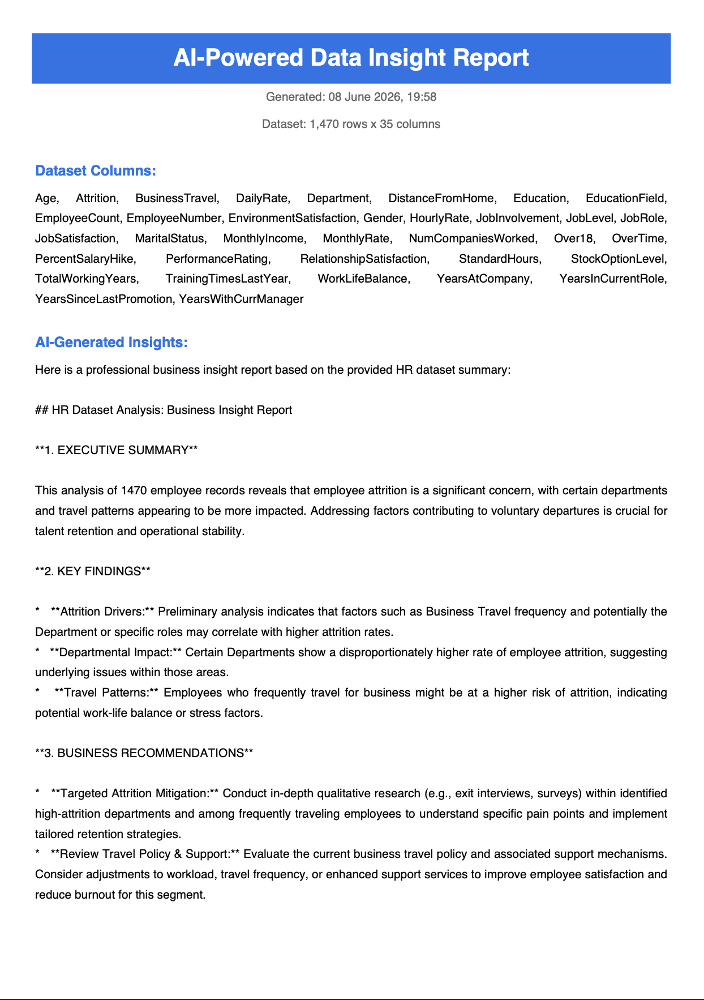

# AI-Powered Data Insight Generator

An automated business insight generator that uses **Google Gemini AI** to analyse any CSV dataset and produce a professional PDF report — instantly.

---

## Live Demo



---

## What It Does

Upload any CSV dataset → Python analyses it → Gemini AI writes a full business insight report → PDF generated automatically.

---

## Project Overview

| Component | Tool Used |
|---|---|
| Data Loading & Analysis | Python, Pandas |
| AI Insight Generation | Google Gemini AI (gemini-2.5-flash) |
| PDF Report Generation | FPDF2 |
| Environment Management | Python-dotenv |

---

## Sample Output

The tool generates a professional PDF report containing:

- **Executive Summary** — 2-3 sentence business overview
- **Key Findings** — 3 bullet points of most important insights
- **Business Recommendations** — 2 actionable recommendations

---

## How To Run

1. Clone the repository
2. Install dependencies:
```bash
pip install pandas google-genai fpdf2 python-dotenv
```
3. Create a `.env` file with your Gemini API key:
GEMINI_API_KEY=your_key_here
4. Add your CSV dataset to the `data/` folder as `sample_data.csv`
5. Run:
```bash
python scripts/insight_generator.py
```

---

## Repository Structure

```
ai-insight-generator/
│
├── data/
│   └── sample_data.csv          (input dataset)
│
├── output/
│   └── insight_report_*.pdf     (generated reports)
│
├── scripts/
│   └── insight_generator.py     (main script)
│
├── .env                         (API key — not pushed to GitHub)
├── .gitignore
├── report_screenshot.png
└── README.md
```
---

## Tools and Technologies

- **Python** — Pandas, FPDF2
- **Google Gemini AI** — automated insight generation
- **PDF Generation** — professional formatted reports
- **GitHub** — version control and documentation

---

## Author

**Vinit Bhalerao**
Data Analyst | SQL | Python | Power BI | BigQuery | AI Analytics
[LinkedIn](https://www.linkedin.com/in/bhalerao-vinit3013) | [Portfolio](https://vinitbportfolio.netlify.app)

